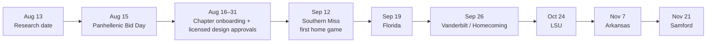

# Auburn Game-Day Buttons & Stickers Competitive Landscape

## Executive summary

The Auburn market is attractive, highly concentrated around a handful of calendar moments, and already competitive at the low end of the price spectrum. Auburn Panhellenic represents **18 sororities and more than 6,800 members—47% of Auburn's female undergraduate population**. Fall 2026 primary recruitment runs August 6–15, with Bid Day on August 15. Football then supplies another concentrated demand engine: Jordan-Hare Stadium holds 88,043, Auburn has six 2026 home games, 2026 season tickets are sold out, and the Florida, Vanderbilt and LSU home games are already sold out on the primary market. citeturn20search0turn20search6turn20search12turn28search0turn28search4

The competitive conclusion is straightforward: **a business built around undifferentiated $5–$6 Auburn buttons will be easy to copy and difficult to defend**. Existing competitors already span every major price tier. Auburn University Bookstore sells buttons from $2.99 to $8; local Button Girl/SimplyChicGreek sells 3-inch Auburn and sorority buttons around $4–$4.50; Preppy Button Co. has a 53-SKU Auburn button assortment concentrated around $6; Therapy Boutique charges $8; embroidered Tailgate Creations buttons reach $10; and Zazzle can sell personalized, officially licensed Auburn buttons around $3.56 during current promotions. citeturn22search0turn23search2turn25search15turn22search5turn25search30turn29search7

**The most serious competitor is Button Girl/SimplyChicGreek.** It combines the characteristics a new entrant should want to copy and then outperform: Auburn location, explicit collegiate-and-Greek licensing on relevant merchandise, customization, low pricing, approximately 3,200 Etsy sales, 428 reviews at a 5.0 displayed rating, and 13 years on Etsy. Its catalog explicitly mixes Auburn football and specific sororities, precisely overlapping the proposed business. citeturn23search2turn27search15

**Preppy Button Co. is the strongest specialist competitor.** It is nearby in Opelika, has 53 Auburn gameday-button SKUs in the indexed collection, sells typical 3-inch Auburn buttons for $6, explicitly labels sampled Auburn products officially licensed, carries merchandise across all 18 sororities listed on its site, and offers custom photo buttons plus wholesale. Its Facebook page has roughly 1,700 likes. citeturn25search2turn25search15turn23search1turn23search6

**The best opening is not simply “cute Auburn buttons.” It is a licensed, hyperlocal, chapter-integrated rapid-fulfillment business.** The strongest whitespace in the sampled market is the combination of: Auburn + sorority dual-brand authorization; coordinated sticker/button drops for every home opponent; chapter bulk programs; Friday delivery and Saturday-morning pickup; no-DM checkout personalization; and six-game season packs. Classic City Customs proves there is demand for the Auburn+sorority intersection but operates from Athens, Georgia; Button Girl proves dual-licensed local merchandise works but its online lead time is measured in days rather than hours; Auburn Bookstore and J&M have excellent local distribution but little visible sorority-level customization. citeturn25search0turn25search1turn23search2turn22search0turn22search1

**Licensing should be treated as a competitive moat rather than an administrative afterthought.** Auburn says its brand is licensed to approximately 500 consumer-product companies and directs prospective licensees through CLC. A CLC retail license is the appropriate category for selling collegiate-trademark merchandise directly to consumers; the current application fee starts at $250, approval requires university review, and approved retail licensees face requirements including $1 million-plus commercial insurance, supply-chain disclosure, artwork approval and official hologram labeling. Greek marks are a separate issue: Affinity manages commercial trademark use for more than 100 Greek organizations, and its licensing regime includes royalties on gross sales and quarterly reporting. citeturn30view0turn30view1turn30view2turn29search1turn29search9

My competitive-threat scoring, based on local proximity, Auburn/sorority overlap, price competitiveness, public reach, customization and explicit licensing evidence, ranks the principal competitors as follows. This is an analytical score rather than a measure of revenue or market share.

| Competitor | Threat score / 5 | Principal reason |
|---|---:|---|
| **Button Girl / SimplyChicGreek** | **4.8** | Local + low-price + customized + explicitly licensed Auburn/Greek overlap + proven Etsy sales. citeturn23search2turn27search15 |
| **Preppy Button Co.** | **4.4** | Deepest specialist assortment, local/Opelika presence, official Auburn license, sorority breadth. citeturn25search2turn25search15turn23search1 |
| **Auburn University Bookstore** | **4.3** | Campus authority, foot traffic, official channel, 32K Instagram following and $2.99 entry price. citeturn21search0turn22search0 |
| **J&M Bookstore** | **3.9** | Exceptional downtown location, Auburn heritage since 1953, 18K Instagram followers, very deep decal inventory. citeturn21search1turn22search1turn22search7 |
| **Tiger Rags** | **3.8** | Heritage/game-specific drops and downtown pickup, although the current button assortment is narrow. citeturn23search0turn21search3 |
| **Zazzle / AuburnUniversity** | **3.6** | Official license, nationwide POD economics, personalization and very low single-unit pricing. citeturn29search2turn29search7 |
| **Classic City Customs** | **3.6** | Excellent Auburn+sorority product fit and aggressive sticker pricing, offset by Athens location and unclear licensing status. citeturn25search0turn25search1turn25search29 |
| **Therapy Boutique** | **3.4** | Huge local social reach and fashion bundling, but $8 buttons and little visible customization. citeturn21search2turn22search5turn28search1 |

## Market context and research scope

The timing is unusually favorable for an entrant that can move immediately. As of August 13, 2026, Auburn Panhellenic recruitment is in progress and Bid Day is August 15. Auburn describes Bid Day as one of the largest single-day campus events, involving thousands of students and guests, but access to the Sorority Village programming space is controlled by Panhellenic wristbands until programming concludes. That makes **pre-orders, chapter delivery and authorized chapter partnerships materially more realistic than attempting an unauthorized pop-up inside Sorority Village**. citeturn20search0turn20search12

After recruitment, there is almost exactly one month until Auburn's first home football game. The six home dates are Southern Miss on September 12, Florida on September 19, Vanderbilt/Homecoming on September 26, LSU on October 24, Arkansas on November 7 and Samford on November 21. Florida is a 6 p.m. kickoff, LSU is currently 11 a.m., and the Southern Miss opener is a night game; those different kickoff windows create materially different pickup and impulse-purchase patterns. citeturn28search0turn28search12

Demand concentration should not be underestimated. Jordan-Hare has a capacity of 88,043, and Auburn reports more than 75,000 season tickets sold for home games in each of the past 18 years. For 2026, season tickets are sold out, while Florida, Vanderbilt and LSU were already sold out through Auburn's primary ticket channel at the time of research. citeturn20search1turn28search4

The Panhellenic niche is similarly large for an accessory business. Auburn reports more than 6,800 Panhellenic members across 18 chapters, and Greek Sing 2026 attracted more than 8,000 students, parents and community members. That means the addressable buyer is broader than active sorority members: parents, siblings, boyfriends, alumni and prospective members are already explicit product segments in the competitor catalogs. citeturn20search6turn20search10turn23search2turn23search1

Research prioritized Auburn's official licensing and Student Affairs pages, CLC and Affinity/Greek Licensing; direct retailer websites; Etsy; Instagram and Facebook; Auburn-area public craft-market information; and Alabama business-registry resources. Public social counts should be viewed as **snapshots**, not audited figures. Revenue, employee counts and actual unit sales are not publicly available for most private competitors, so I do not fabricate them; “scale” below uses observable followers, reviews, Etsy sales, inventory breadth and physical footprint instead.

A public 2026 Auburn campus-event vendor roster identifying independent button/sticker vendors did not surface in the reviewed official sources. Auburn's official business guidance routes university suppliers through its procurement framework, while Auburn Risk Management says promotional vendors, exhibitors and most vendors providing goods or using university facilities generally must provide a Certificate of Insurance. Consequently, “campus vendor” should not be equated with “any seller who can set up near the stadium.” citeturn9view0turn30view5

The City of Auburn's **City Market** is relevant as a local handmade-sales channel rather than a football-specific competitor list. Its 2026 season runs Saturdays from May 23 through August 29 and is intended for local handmade products, but every 2026 date is currently full and new applicants are placed on a waitlist. Because the market ends before Auburn's September 12 home opener, it is more useful for brand-building/recruitment-season exposure than as a core football-weekend channel this year. citeturn30view3

Representative products illustrate how tightly the current visual language has converged around 3-inch circles, Auburn navy/orange, retro tigers, collegiate typography, sorority letters and “cute game-day accessory” positioning. The first image below is a Preppy Button Co. licensed Auburn design; the second is a SimplyChicGreek/Button Girl Auburn-sorority design. The remaining images illustrate the broader Auburn button aesthetic appearing in online category results.

iturn28image0turn28image1turn28image4turn28image5

## Direct competitor landscape

The table separates **verified observations** from anything that could not be established publicly. “Licensing unspecified” does **not** mean a seller is unlicensed; it means the sampled page did not provide sufficient evidence to make that claim.

| Direct competitor | Location & channels | Product range / price | Brand positioning | Public scale proxy | Lead time / fulfillment |
|---|---|---|---|---|---|
| **[Auburn University Bookstore](https://www.aubookstore.com/gifts/buttons)** | Haley Center, Auburn; campus store, e-commerce, Instagram/Facebook. The Instagram account describes itself as Auburn's official bookstore. citeturn21search0 | 11-button catalog: **$2.99–$8**, plus $9.99 Aubie sports pack. Stickers/decals/magnets include dozens of SKUs; sampled decals run roughly $2.50–$7.99. citeturn22search0turn22search3 | Institutional/official, Aubie, alumni, parents, campus landmarks and broad Auburn pride rather than chapter customization. citeturn22search0 | **~32K Instagram followers**, 2.8K+ posts. citeturn21search0 | In-stock merchandise can be bought immediately in store; online delivery time for these SKUs was **unspecified** in reviewed pages. |
| **[J&M Bookstore](https://www.jmbooks.com/)** | 115 S. College St., downtown Auburn near Toomer's; physical store + e-commerce + Instagram. citeturn22search7turn21search1 | Buttons category plus extremely deep decal inventory; sampled decals **$2.99–$5.99**, including $3 Auburn wordmark decal. Button prices were not reliably exposed in the indexed catalog. citeturn22search1turn22search13 | “Auburn Family” heritage retailer; broad licensed-looking collegiate assortment and impulse-accessory depth. Individual sampled licensing status was not explicitly stated. citeturn21search1turn22search7 | **~18K Instagram followers**; operating since **1953**. citeturn21search1 | Immediate for in-stock local purchases; shipping lead **unspecified**. Custom chapter service not surfaced. |
| **[Tiger Rags](https://tigerrags.com/collections/buttons-1)** | Auburn; e-commerce + downtown physical pickup/store presence + Instagram. citeturn23search0turn21search3 | Current indexed button page has only **2 products**, Mercer and Missouri game buttons, **$3 sale / $7 regular**; broader line includes $42 tees and $52–$60 crewnecks. citeturn23search0turn23search5 | Auburn heritage, vintage graphics and game/opponent-specific drops; Instagram describes the business as “Vintage and Licensed Auburn Apparel.” citeturn21search3 | **~5.9K Instagram followers**. citeturn21search3 | Local store/pickup available. Button-specific turnaround **unspecified**. |
| **[Therapy Boutique](https://www.shoptherapyauburn.com/products/gameday-buttons)** | 150 E. Magnolia Ave., downtown Auburn; store, e-commerce, Instagram; the business also promotes social-shopping channels. citeturn28search3turn21search2 | Auburn/Beat Bama/Mom/Dad/game-day buttons **$8**; very broad Auburn fashion catalog including dresses, bags, scarves and gifts. citeturn22search5turn22search11turn22search17 | Trend-driven women's boutique: button as the finishing accessory to the game-day outfit, rather than the hero product. citeturn22search5turn21search10 | **~35K Instagram followers**, the largest local social audience in this set. citeturn21search2 | FAQ says orders before 2 p.m. M–F can be prepared for pickup about **2 hours** after confirmation; ordinary online processing may take up to **3–5 business days**. citeturn28search1 |
| **[Preppy Button Co.](https://preppybuttonco.com/collections/auburn-gameday-buttons)** | Opelika, Alabama; Shopify, Facebook/Instagram, custom and wholesale. citeturn25search2turn25search5 | **53 Auburn gameday-button SKUs**, generally **$6**, with some $7; custom photo buttons, magnets, graduation buttons, jewelry, wreath sashes and all 18 listed sorority groups. citeturn25search15turn23search6 | Specialist “preppy” button/accessory brand with deep school, family and Greek segmentation. Sampled Auburn Mom/Dad products are **officially licensed** and 3-inch, made in USA. citeturn23search1turn23search4 | Facebook page shows roughly **1,732 likes**; public revenue/sales unspecified. citeturn25search2 | Retail MOQ 1. Button-specific published turnaround **unspecified** in sampled pages. |
| **[SimplyChicGreek / Button Girl](https://www.etsy.com/shop/SimplyChicGreek)** | Auburn, Alabama; Etsy + Button Girl web/social presence + Facebook. citeturn23search2turn27search3 | Auburn football and sorority 3-inch buttons mostly **$4–$4.50**; sets of three $12; decals $5; magnets $10; acrylic gifts $10–$25; custom orders and bulk discounts. citeturn23search2turn27search15 | Hyperlocal Auburn + Greek specialist, including parents, Big/Little, chapter-specific and Auburn/Aubie crossover merchandise. Relevant Auburn/Greek listings explicitly state official licensing. citeturn27search15 | **3.2K Etsy sales, 428 reviews, displayed 5.0 rating, 13 years on Etsy**; Facebook page roughly 1K likes. citeturn23search2turn27search3 | Current Etsy estimates on reviewed Auburn products were roughly **5–9 days to customer**; reviews repeatedly mention fast arrival. Exact rush/local-pickup policy unspecified. citeturn1view1turn23search2 |
| **[Classic City Customs](https://classiccitycustoms.com/collections/auburn-university-sorority-gameday-buttons)** | Athens, Georgia; Shopify, Instagram, TikTok/Pinterest links; local Athens pickup and nationwide shipping. citeturn24search0turn25search3 | Auburn+sorority buttons **$6**; Auburn+sorority sticker **2-packs $3**; custom any-school, any-sorority, any-color designs. citeturn25search0turn25search1 | Extremely close concept match: trendy school-color design crossed directly with Greek letters and parent variants. | **~1.8K / 1,776 Instagram followers** in indexed profile. citeturn25search29 | Athens pickup or shipping anywhere; turnaround **unspecified**. Licensing status on sampled Auburn/Greek pages **not stated**. |
| **[Tailgate Creations](https://www.tailgatecreations.com/products/orange-navy-tigers-white-paisley-1)** | Florida-based mother/daughter company; website + Instagram/Pinterest; nationwide. citeturn26search2turn26search3 | Handcrafted **3-inch embroidered fabric** school/sorority buttons; sampled Auburn orange/navy sorority design **$10**; group/custom orders encouraged. citeturn25search30turn26search2 | Premium tactile alternative to printed metal buttons: embroidery, fabric, seersucker and chapter personalization. | Instagram indexed at **1K+ followers / 1.4K+ posts**; Pinterest gameday board contains 62 pins. citeturn26search3turn26search0 | Custom/group turnaround and MOQ **unspecified**. Sampled pages did not state Auburn/Greek license status. |
| **[PIN IT UP!](https://www.instagram.com/pinitup.shop/)** | Instagram-first Auburn-focused micro-seller; location not explicitly disclosed in the indexed profile. | Auburn buttons advertised at **$5 for 3-inch and $3.75 for 2.25-inch**; custom orders welcome. citeturn27search0turn27search1 | Very small, informal, social-first, custom/local aesthetic competing primarily on immediacy and approachable price. | **123 Instagram followers** at research snapshot; individual launch posts had only a few likes. citeturn27search1turn27search18 | DM/order-form style fulfillment; MOQ, pickup, lead time and licensing **unspecified**. |
| **[HOWDY BUTTONS](https://www.instagram.com/howdy_buttons/)** | Instagram-first seller focused explicitly on Auburn. | Auburn game-day, sorority and parent/family buttons; detailed current price list not surfaced. citeturn27search2 | Narrow Auburn micro-brand, showing the low barrier to entry at the social-seller end of this market. | **136 followers, 16 posts** in indexed profile. citeturn27search2 | DM/social fulfillment; prices, MOQ, lead time, pickup and licensing **unspecified**. |
| **[BaronButtons](https://www.etsy.com/listing/4338306953/auburn-gameday-buttons)** | Etsy seller; shop profile says Missouri, while the current Auburn listing ships from Fayetteville, Arkansas. citeturn26search1 | 3-inch Auburn gameday buttons **$6**; custom gameday buttons **$8**; multiple college teams. citeturn26search1 | Marketplace-style multi-school gameday specialist. | **1.4K Etsy sales, 168 reviews, displayed 5.0 shop rating, 3 years on Etsy**. citeturn26search1 | Current Auburn listing estimates **Aug. 17–26** delivery for an Aug. 13 order, or roughly 4–13 days; $5.50 shipping shown. Licensing statement **not found**. citeturn26search1 |
| **[Zazzle / AuburnUniversity](https://www.zazzle.com/auburn_university_auburn_ua_logo_button-256780974862631519)** | National print-on-demand marketplace; official Auburn University storefront/product attribution. | Official Auburn buttons around **$3.56 sale / $3.95 regular** in current search; customizable photos/text, multiple shapes/sizes; no minimum quantity category. citeturn29search2turn29search7 | Mass personalization + official marks + national fulfillment; much less Auburn-local personality. | National-scale platform. Its button page displays **8.6K reviews for similar button products**, not 8.6K Auburn-item reviews or sales. citeturn29search2 | MOQ 1; fulfillment/shipping time on sampled Auburn page **unspecified**. **Explicitly officially licensed.** citeturn29search2 |
| **[Redbubble / Kickoff Buttons and other artists](https://www.redbubble.com/shop/auburn-gameday+stickers)** | National POD/independent-artist marketplace. | Auburn-oriented stickers commonly around **$2.58–$4+** during current promotions; Kickoff Buttons Auburn-sorority gameday sticker listings around $2.91 sale/$3.24 regular in the indexed result. citeturn25search16 | Huge design long tail, SEO reach, low commitment and constant new independent-art variations. | Seller-specific sales/follower scale **unspecified** in reviewed results. | MOQ 1; shipping varies. Auburn/Greek license status of sampled independent-artist items **not specified**. |

Two additional observations matter. First, Etsy itself is effectively a competitor: an indexed Auburn-sorority search returned **74+ items**, with visible prices spanning roughly $3.50 for inexpensive printed designs to $10–$12 for more custom/premium pins, plus a $14.99 three-pack. That creates strong price transparency and prevents a new seller from charging a premium merely because the product is “handmade.” citeturn26search5

Second, the Facebook seller layer is fragmented but real. One Auburn-focused group listing advertised handmade gameday buttons at **$6** with custom designs on request. The seller identity and business scale were not reliably exposed in the indexed result, so it is more defensible to treat this as evidence of a low-overhead informal market rather than fabricate a named competitor profile. citeturn25search11

## Offer and price comparison

The table below focuses on the transaction variables most likely to affect conversion.

| Competitor | Buttons | Stickers / decals | Customization | Retail minimum | Shipping / pickup | Explicit Auburn/Greek licensing evidence |
|---|---:|---:|---|---:|---|---|
| **Auburn Bookstore** | $2.99–$8; pack $9.99 | Sampled ~$2.50–$7.99 | Little/no personalization surfaced | 1 | Campus purchase; online available | **Strong Auburn official-channel evidence**; Auburn requires university merchandise purchasing through licensed manufacturers. citeturn22search0turn22search3turn30view0 |
| **J&M** | Price unspecified in indexed button category | ~$2.99–$5.99 sampled | None surfaced | 1 | Downtown Auburn + online | **Unspecified on sampled SKUs**; do not infer from appearance alone. citeturn22search1turn22search7 |
| **Tiger Rags** | $3 sale / $7 regular current indexed products | None surfaced in core current catalog | Custom merch exists; button customization unspecified | 1 | Downtown pickup/store + shipping | Brand says licensed Auburn apparel; sampled current button page does not independently state button-license status. citeturn23search0turn21search3 |
| **Therapy** | **$8** | Not a core sampled category | None shown for buttons | 1 | Downtown pickup; shipping | Button-page license claim **unspecified**. citeturn22search5turn28search1 |
| **Preppy Button Co.** | **$6 typical; some $7** | Magnets rather than a major sticker line in reviewed navigation | Photo/custom buttons; family variants | 1 retail; wholesale offered | Online; local market presence | **Explicit officially licensed Auburn products**. Greek assortment extensive; license status should be verified product-by-product. citeturn25search15turn23search1turn23search6 |
| **Button Girl / SimplyChicGreek** | **$4–$4.50**; 3 for $12; 5-pack $20 | Sorority decals **$5** | **Yes**, custom + bulk discounts | 1 | Etsy/online; local Auburn seller | **Explicit official licensing** on sampled Greek/Auburn merchandise. citeturn23search2turn27search15 |
| **Classic City Customs** | **$6** | **$3 per 2-pack** on most sampled Auburn-sorority stickers | **Yes: school, sorority, colorway** | 1 button; normally 2 stickers/package | Shipping + Athens pickup | **Unspecified on sampled pages.** citeturn25search0turn25search1turn24search0 |
| **Tailgate Creations** | **$10 sampled** | Not core | **Yes**, sorority/group/custom embroidery | 1 shown; group terms unspecified | Online | **Unspecified on sampled pages.** citeturn25search30turn26search2 |
| **PIN IT UP!** | **$3.75–$5** depending on size | Unspecified | **Yes** | 1 implied | Social/DM; fulfillment specifics unspecified | **Unspecified.** citeturn27search0turn27search1 |
| **HOWDY BUTTONS** | Unspecified | Unspecified | Sorority variants promoted | Unspecified | Instagram/DM | **Unspecified.** citeturn27search2 |
| **BaronButtons** | **$6** Auburn; $8 custom | Not core | **Yes**, custom buttons | 1 | Etsy; current $5.50 shipping | **Unspecified** on Auburn listing. citeturn26search1 |
| **Zazzle AuburnUniversity** | **~$3.56 sale / $3.95 regular** sampled | Auburn stickers also available | **Extensive photo/text personalization** | **1 / no minimum** | National POD shipping | **Explicit officially licensed Auburn.** citeturn29search2turn29search7 |
| **Redbubble** | Roughly $3–$5 category-wide | Roughly $2.50–$4+ sampled | Artist-created rather than buyer-custom on most products | 1 | National POD | Independent-listing status **unspecified**. citeturn25search16 |

The important price pattern is that the **mainstream printed-button equilibrium is roughly $4–$6**, with three distinct exceptions: official/institutional products can be both cheaper and more expensive ($2.99–$8 at Auburn Bookstore), fashion boutiques can charge $8 because the button is an outfit accessory rather than a commodity, and premium-material/custom products can reach $10+. citeturn22search0turn23search2turn25search15turn22search5turn25search30

Stickers are even more price-sensitive. Classic City Customs is particularly aggressive at **$3 for two stickers**, effectively $1.50 each, while J&M offers numerous Auburn decals around $2.99–$4.99 and Button Girl lists a Chi Omega decal at $5. citeturn25search1turn22search1turn23search2

That suggests stickers should be treated primarily as **basket-builders, chapter giveaways and customer-acquisition products**, not as the sole source of margin. A strategically stronger architecture would make a sticker easy to add to a $5–$7 button order or use sticker packs as the low-price entry product that captures a customer's phone/email for later opponent-specific drops.

## Indirect competition and market gaps

Indirect competition is much broader than other button makers because the underlying customer need is “show Auburn/sorority identity on game day,” not “buy a round pin.”

**Licensed Auburn merchandise is the largest substitute category.** Auburn's own bookstore, J&M and countless CLC licensees offer decals, apparel, hats, bags, jewelry, magnets, tailgate goods and other inexpensive expressions of affiliation. Auburn says approximately 500 consumer-product companies participate in its licensed merchandise ecosystem, making “Auburn spirit” one of the most heavily supplied parts of the proposition. citeturn30view0turn30view1

**National POD and marketplace sellers create a hard price ceiling for generic designs.** Zazzle can deliver officially licensed personalized Auburn buttons at roughly $3.56 on the current promotion, while Redbubble and Etsy expose buyers to dozens of visually similar alternatives in seconds. Etsy's Auburn-sorority page alone indexed 74+ items. citeturn29search7turn25search16turn26search5

**DIY is another substitute.** Etsy results include custom/digital gameday designs alongside finished buttons, enabling students, parents and chapter members with Cricut-style tools or button presses to internalize production. The existence of inexpensive templates means artwork itself is not a durable moat unless it is distinctive, licensed and continuously refreshed. citeturn26search5

**Fashion competes for the same wallet.** Therapy explicitly positions its $8 buttons alongside clear bags, jackets and dresses, while its broader Auburn collection contains more than 150 products in an indexed category page. A customer deciding whether to buy another $6 pin may instead buy earrings, a scarf or other gameday accessory. citeturn22search5turn22search14

**Sorority-specific gifts compete outside football.** Button Girl and Preppy Button Co. sell acrylic magnets, keychains, shelf décor, graduation merchandise, stoles, jewelry and custom photo products, allowing them to monetize the same customer during recruitment, Big/Little, Parents Weekend, graduation and birthdays. citeturn23search2turn23search6

The most important market gaps are therefore operational and relational rather than simply visual:

| Gap | Competitive evidence | Opening for the new business |
|---|---|---|
| **Fast Auburn-local chapter fulfillment** | Button Girl's sampled Etsy arrival windows are several days; Classic City is in Athens; POD competitors ship nationally. citeturn1view1turn24search0turn29search2 | Guaranteed Friday chapter delivery and same-day Auburn pickup for approved designs. |
| **Buttons + stickers designed as one system** | Preppy is button/magnet-heavy; Bookstore/J&M are Auburn-sticker-heavy without deep sorority personalization; Classic City is the clearest competitor combining both. citeturn23search6turn22search1turn25search0turn25search1 | Matching button, laptop sticker, clear-bag decal and chapter pack for every design. |
| **Dual Auburn + chapter + weekly-opponent drops** | Button Girl handles Auburn+sorority well, while Tiger Rags demonstrates opponent-specific scarcity, but no sampled competitor presents a comprehensive current six-home-game × 18-chapter system. citeturn23search2turn23search0turn28search0 | Build modular, pre-approved templates allowing rapid weekly drops. |
| **Six-game subscription / season pass** | No such subscription surfaced among the sampled principal button competitors. This is a finding from the reviewed set, not proof that none exists anywhere. | Prepay for six home-game buttons + six stickers with chapter-specific variants and priority pickup. |
| **Chapter fundraising/revenue-share model** | Competitors publicly emphasize retail/custom sales more than structured Auburn-chapter partnerships. | Make each participating chapter a distribution and acquisition partner, subject to national-organization and university rules. |
| **Checkout-level customization** | Micro-sellers and Classic City often rely on DM/contact workflows; Zazzle demonstrates that customers value instant personalization. citeturn24search0turn27search1turn29search2 | Live preview for chapter, parent role, year, opponent and optional name. |
| **Premium + commodity within one brand** | Market is fragmented between $3–$6 printed buttons and ~$10 embroidered products. citeturn23search2turn25search30 | Carry standard, premium foil/embroidered/pearled and limited numbered drops together. |
| **Game-day logistics as the product** | National sellers cannot solve “I need it before kickoff today”; local stores mostly sell static inventory. | Mobile order-ahead, QR pickup, downtown partner pickup and tailgate delivery where law/permission allows. |

A particularly notable weakness in incumbent assortments is **freshness**. Tiger Rags historically owns the game-specific-drop concept, but its currently indexed button collection on August 13 contains only Mercer and Missouri products, while neither school appears on Auburn's 2026 football schedule. That may simply reflect a between-season website state rather than an abandoned strategy, but it demonstrates the opportunity for a seller whose site is always synchronized to the current schedule. citeturn23search0turn28search0

The local craft-market route is not an immediate answer to this problem. City Market's remaining 2026 dates are full and its season ends August 29, so a new entrant should regard private-property pop-ups, retailer partnerships, chapter pre-delivery and e-commerce pickup infrastructure as more controllable football-season channels. citeturn30view3

## SWOT of the eight most serious competitors

| Competitor | Strengths | Weaknesses | Opportunities | Threats |
|---|---|---|---|---|
| **Button Girl / SimplyChicGreek** | Best combination of Auburn location, explicit Greek/Auburn licensing evidence, **$4–$4.50 pricing**, customization and long Etsy history; 3.2K sales/428 reviews. citeturn23search2turn27search15 | Much smaller public social reach than Therapy/Auburn Bookstore; Etsy dependence exposes products directly beside cheaper substitutes. citeturn23search2turn21search2 | Could extend local pickup, chapter programs and event bundles. | A new licensed local competitor can attack precisely where Etsy is weakest: immediacy, in-person service and chapter exclusivity. |
| **Preppy Button Co.** | **53 Auburn gameday SKUs**, explicit official Auburn licensing on sampled items, custom/photo capability, broad 18-sorority navigation and wholesale infrastructure. citeturn25search15turn23search1turn23search6 | $6 is above Button Girl's $4–$4.50 price; button-specific turnaround is not prominent in sampled pages. citeturn23search2turn25search15 | Wholesale placements and Auburn-family occasion expansion. | Button Girl on price/local credibility; bookstore on official trust; a chapter-exclusive competitor on personalization. |
| **Auburn University Bookstore** | Irreplaceable campus legitimacy, direct Auburn association, 32K Instagram following, wide selection and a $2.99 opening price. citeturn21search0turn22search0 | Limited visible customization and little chapter-by-chapter sorority segmentation in sampled button catalog. citeturn22search0 | More opponent-specific and family/event collections. | Specialist sellers can move faster on memes, feminine aesthetics, chapter specificity and custom quantities. |
| **J&M Bookstore** | Premier downtown location at 115 S. College, heritage since 1953, 18K social following and extremely deep decal selection. citeturn21search1turn22search1turn22search7 | Primarily a broad Auburn retailer rather than a button/sorority specialist; customization is weak in reviewed assortment. | Game-weekend foot traffic and impulse accessory bundling are natural advantages. | Social-first shops can own trends before a broad retailer resets inventory. |
| **Tiger Rags** | More than four decades of Auburn game-day brand equity, distinctive vintage/opponent-drop identity and local physical presence. citeturn21search3turn23search0 | Current indexed button collection has only two older opponent products; stickers are not prominent. citeturn23search0 | A fully refreshed 2026 opponent series could immediately leverage existing brand loyalty. | A startup can reproduce the weekly-drop rhythm while adding chapter-specific versions and stickers. |
| **Therapy Boutique** | **~35K Instagram followers**, downtown pickup, strong fashion context, same-day weekday pickup and demonstrated willingness of customers to consider an $8 accessory. citeturn21search2turn22search5turn28search1 | $8 is materially above specialist-button market prices; no strong customization proposition surfaced. citeturn23search2turn25search15turn22search5 | Influencer bundles and “complete the outfit” cross-sells. | Dedicated button/sticker sellers can undercut price while offering far more designs and personalization. |
| **Classic City Customs** | One of the closest concept matches: Auburn+sorority buttons at $6, two stickers for $3, and customization for any school/sorority/colorway. citeturn25search0turn25search1turn24search0 | Located in Athens rather than Auburn; only 1.8K-ish Instagram audience; sampled pages do not state Auburn/Greek licensing. citeturn25search29 | Can scale the same template architecture nationally across SEC schools. | Auburn-local fulfillment and formal dual licensing can become meaningful competitive disadvantages if a new entrant executes them well. |
| **Zazzle / AuburnUniversity** | Officially licensed, virtually unlimited personalization, national POD capacity, no minimum and a current ~$3.56 promotional price. citeturn29search2turn29search7 | No Auburn-local immediacy, no chapter relationship, and products live in a huge generic catalog rather than a culturally intimate Auburn brand. | SEO and long-tail personalization can absorb thousands of niche queries cheaply. | Hyperlocal pickup, handcrafted/premium construction and chapter exclusivity are difficult for a national POD platform to emulate. |

The overall SWOT implication is favorable to a new entrant **only if the entrant deliberately avoids competing on generic printing capacity**. Production itself is commoditized: dozens of Etsy sellers, social micro-sellers and POD systems demonstrate how easy it is to put Auburn-colored artwork on a circle. What remains defensible is permission to use the marks, exclusive relationships, local fulfillment, customer data, original artwork and a recurring product calendar. citeturn26search5turn27search1turn29search7

## Differentiation strategy, launch plan, and legal path

Eight tactics should be treated as one integrated strategy rather than eight unrelated ideas.

| Priority | Tactical differentiation strategy | Recommended execution |
|---|---|---|
| **Highest** | **Secure dual licensing and turn compliance into the brand moat** | Apply for the appropriate **CLC retail license** before commercially using Auburn-owned marks, and separately obtain the necessary Affinity/individual Greek-organization rights for chapter names, letters, crests and other protected identifiers. Build “Officially Licensed” authentication into packaging and product pages once approvals permit it. CLC's current retail application starts with a $250 non-refundable fee; approval may involve $1M+ commercial insurance, manufacturing disclosure, artwork approval and hologram labels. Affinity's program requires royalty reporting on gross licensed sales. citeturn30view1turn30view2turn29search9 |
| **Highest** | **Create an 18-chapter × six-home-game modular product engine** | Design a master visual system in which approved chapter identifiers, parent roles, class year and opponent/game theme can be swapped without redesigning from zero. Auburn has 18 Panhellenic chapters and six 2026 home games, creating up to **108 chapter/game combinations before family variants**. citeturn20search0turn28search0 |
| **High** | **Price as a three-tier portfolio instead of one SKU** | Target roughly **$5–$6 standard 3-inch buttons**, **$3 sticker two-packs or sticker add-ons**, and **$8–$12 premium/limited products** such as embroidery, metallic foil, pearl accents or numbered rivalry editions. Those price points deliberately bracket Button Girl/Preppy in the middle, Classic City's sticker economics at the entry level and Therapy/Tailgate at the premium end. citeturn23search2turn25search15turn25search1turn22search5turn25search30 |
| **High** | **Make sororities partners, not merely audience segments** | Recruit one merchandise/ambassador contact per chapter. Offer chapter-exclusive approved artwork, bulk pricing, scheduled house delivery, and—where national-organization/university policies permit—a transparent fundraising or affiliate share. Coordinate directly with the relevant organization's licensing rules; a chapter relationship does not itself substitute for commercial trademark permission. Affinity oversees commercial trademark use for more than 100 Greek organizations. citeturn29search1turn29search12 |
| **High** | **Win game day through logistics** | Establish Wednesday/Thursday preorder cutoff, Friday chapter/retailer delivery and Saturday-morning QR pickup at authorized **off-campus/private-property** partner sites. Carry a smaller walk-up assortment matched to kickoff time. Do not build the plan around unauthorized vending inside controlled university areas; Auburn generally requires insurance from promotional vendors using university facilities. citeturn30view5turn20search12 |
| **Medium-high** | **Own short-form social at chapter level rather than buying generic reach** | Use 18 chapter micro-ambassadors plus parent/alumni creators. The weekly format should be reveal → try-on/bag styling → chapter repost → Thursday order deadline → Saturday “seen in the wild” montage. This targets the weakness of incumbents with large but broad audiences: Therapy has ~35K followers and the Bookstore ~32K, while specialists are substantially smaller. citeturn21search2turn21search0turn25search29 |
| **Medium-high** | **Build distribution through Auburn businesses instead of immediately relying on campus vending** | Pursue consignment/wholesale or weekend mini-displays with complementary downtown boutiques, coffee shops, salons, gift shops and other private businesses, subject to retailer permission and licensing terms. J&M and Therapy demonstrate how valuable downtown convenience is; City Market is already full for 2026, so owned/partner retail is the more controllable near-term channel. citeturn21search1turn28search3turn30view3 |
| **Medium** | **Turn single purchases into a recurring season product** | Sell a “Home Six” season box/pass: six opponent-specific buttons, six matching stickers, priority pickup and one mystery rivalry/family product. No equivalent six-game subscription surfaced in the sampled principal competitors. Pair every purchase with QR-based reorder/customer capture so the first $5 sale creates a repeat customer rather than an anonymous game-day transaction. |

The tactical calendar should exploit the unusually clean sequence from recruitment into football:

The schedule dates are Auburn's currently published 2026 dates; kickoff details can still change within the SEC's published television-window process. citeturn28search0turn28search12

There is one critical legal distinction in executing that calendar: **chapter authorization, university authorization and venue permission are three different things**. Auburn trademark permission is handled through Auburn/CLC; Greek marks are administered through the applicable Greek organization/Affinity where relevant; and physical selling on university property creates separate vendor/insurance/venue requirements. A chapter president or merchandise chair should therefore never be treated as the sole commercial trademark authorization for a dual-branded product. citeturn30view1turn30view2turn29search1turn30view5

CLC's requirements also affect the business model. Its retail license allows sale of collegiate-trademark products through approved retail channels and directly to consumers. The process includes application, CLC review, institutional review, and, after approval, commercial insurance, supply-chain disclosure, potential Fair Labor Association obligations, hologram ordering, agreement execution and artwork approval. CLC explicitly says institutions favor applicants that offer a **new or unique product or incremental distribution**, have production/distribution capability, marketing investment, successful-business history, retailer relationships and systems capable of approval/royalty reporting. That strongly supports presenting the licensing application not as “another Auburn button shop,” but as a **rapid-response, local, Greek-integrated, omnichannel accessory platform**. citeturn30view2

Auburn's own vendor-insurance rules reinforce the case for professionalizing early. With limited exceptions, vendors providing goods or using university facilities must provide a Certificate of Insurance; Auburn's standard general-liability framework includes $1 million per occurrence and $2 million aggregate levels, with Auburn named as an additional insured where applicable. citeturn30view5

For Greek merchandise, Affinity states it is retained by more than 100 Greek organizations to administer commercial trademark use; its current licensing information requires licensees to pay royalties based on gross sales and report/pay quarterly. The company's site says more than 1,500 licensed vendors already participate in the Greek market. citeturn29search1turn29search9turn29search12

The ideal competitive position one year from launch is therefore:

> **Not the cheapest Auburn button company, but the fastest, most chapter-connected, fully authorized source for the thing Auburn fans and sororities want to wear this week.**

That positioning is much harder for Zazzle or an Etsy seller hundreds of miles away to reproduce, while simultaneously avoiding a head-on price war with Auburn Bookstore, Button Girl and Preppy Button Co.

## Source notes and links

The highest-weight sources in this analysis are official Auburn University, Auburn Athletics, CLC and Greek Licensing/Affinity pages. Current product prices and social metrics are point-in-time observations retrieved August 13, 2026 and may change without notice.

| Primary source | What it establishes |
|---|---|
| [Auburn Trademark Management & Licensing](https://licensing.auburn.edu/) | Auburn's licensing program, licensed-product ecosystem and official policy framework. citeturn30view0 |
| [Auburn — Get Licensed](https://licensing.auburn.edu/get-licensed/) | Auburn route for prospective CLC licensees. citeturn30view1 |
| [CLC — Get Licensed](https://clc.com/home/get-licensed/) | Retail vs. internal licenses, application process, fees, insurance, hologram and approval requirements. citeturn30view2 |
| [CLC License Search](https://clc.com/license-search/) | Official CLC lookup interface for checking licensees by product category and school. citeturn20search2 |
| [Greek Licensing / Affinity](https://greeklicensing.com/) | Greek trademark-license framework and licensed-vendor ecosystem. citeturn29search12 |
| [Greek Licensing — Licensing Information](https://greeklicensing.com/licensing/info) | Royalties, reporting and license terms. citeturn29search9 |
| [Auburn Panhellenic](https://studentaffairs.auburn.edu/greek/community/panhellenic/join-panhellenic.php) | 18 chapters and current 2026 recruitment dates. citeturn20search0 |
| [Auburn Greek Life overview](https://studentaffairs.auburn.edu/greek/how-to-join.php) | 6,800+ Panhellenic members and 47% female-undergraduate penetration. citeturn20search6 |
| [Auburn 2026 Football Schedule](https://auburntigers.com/sports/football/schedule) | Six home-game dates, opponents and kickoff information. citeturn28search0 |
| [Jordan-Hare Stadium](https://auburntigers.com/jordan-hare-stadium) | 88,043 capacity and long-running season-ticket demand. citeturn20search1 |
| [Auburn Risk Management — Vendor Insurance](https://ba.auburn.edu/rms/risk-management-insurance/insurance-requirements/) | University vendor/exhibitor insurance requirements. citeturn30view5 |
| [City of Auburn — City Market](https://www.auburnal.gov/parks/programs/city-market/) | Local handmade-market schedule, vendor waitlist and 2026 capacity. citeturn30view3 |
| [Etsy — SimplyChicGreek](https://www.etsy.com/shop/SimplyChicGreek) | Button Girl's Auburn location, pricing, sales/reviews and assortment. citeturn23search2 |
| [Preppy Button Co. — Auburn Gameday](https://preppybuttonco.com/collections/auburn-gameday-buttons) | Auburn specialist assortment and pricing. citeturn25search15 |
| [Classic City Customs — Auburn Sorority Buttons](https://classiccitycustoms.com/collections/auburn-university-sorority-gameday-buttons) | Auburn+sorority button assortment. citeturn25search0 |
| [Classic City Customs — Auburn Sorority Stickers](https://classiccitycustoms.com/collections/auburn-university-sorority-gameday-stickers) | Two-pack sticker pricing and matching designs. citeturn25search1 |
| [Auburn University Bookstore — Buttons](https://www.aubookstore.com/gifts/buttons) | Campus button assortment and price ladder. citeturn22search0 |
| [J&M — Decals](https://www.jmbooks.com/other/auto/decals/) | Downtown local decal breadth/pricing. citeturn22search1 |
| [Therapy Boutique — Gameday Buttons](https://www.shoptherapyauburn.com/products/gameday-buttons) | $8 fashion-positioned Auburn buttons. citeturn22search5 |
| [Tiger Rags — Buttons](https://tigerrags.com/collections/buttons-1) | Current game-specific button assortment and prices. citeturn23search0 |
| [Tailgate Creations](https://www.tailgatecreations.com/) | Premium embroidered sorority/game-day format and customization. citeturn26search2 |
| [Zazzle — Official Auburn Button](https://www.zazzle.com/auburn_university_auburn_ua_logo_button-256780974862631519) | Official POD personalization benchmark. citeturn29search2 |

The **Alabama Secretary of State Business Entity Search** was also prioritized, but the dynamic registry interface did not expose sufficiently reliable entity-level records through the research crawler to connect every consumer brand/DBA above with a legal entity. Legal entity name, formation date and standing should therefore be treated as **unspecified pending manual registry verification**, rather than inferred from the storefront name. citeturn11search0

Likewise, no durable Facebook Marketplace listing set or official 2026 Auburn campus-event vendor list identifying named button/sticker businesses was sufficiently accessible to support market-share claims. The Facebook evidence that did surface points to active $6/custom informal sellers, while official Auburn sources establish a more formal vendor, licensing and insurance framework for university-related commerce. citeturn25search11turn30view2turn30view5